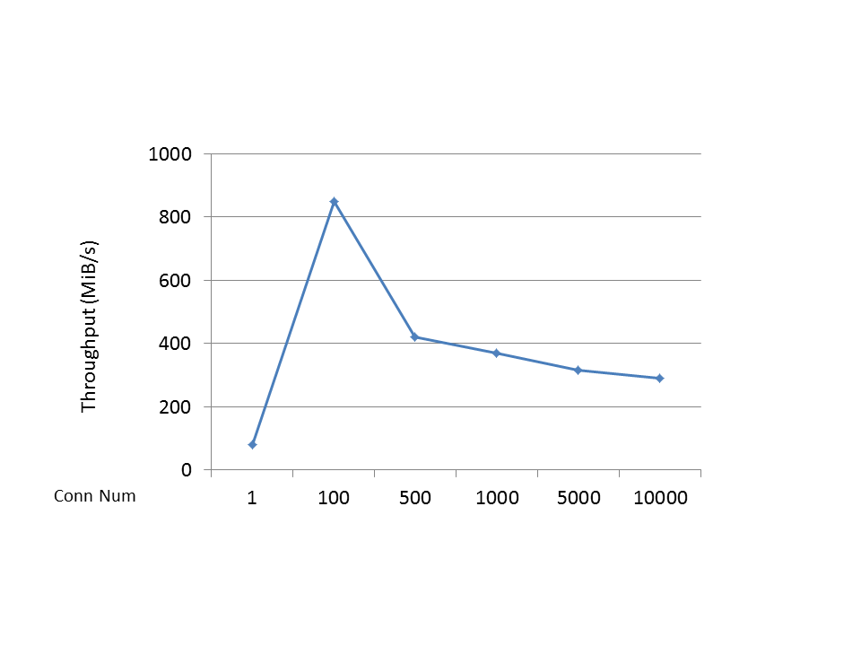
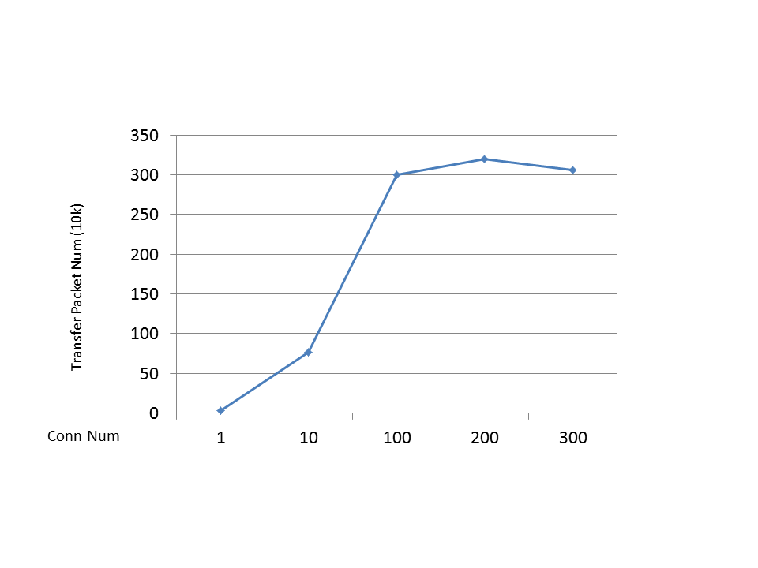

Brynet
=======
Cross platform high performance TCP network library using C++ 11.

Windows :  Linux : 

## Features
* Cross platform (Linux | Windows)
* High performance and safety use.
* None depend
* Multi-threaded
* SSL support
* Support HTTP、HTTPS、WebSocket
* IPv6 support

## Documentation
- [简体中文](https://github.com/IronsDu/brynet/blob/master/docs/main.zh-cn.md)

## Compatibility
* Visual C++ 2013+ on Windows (32/64-bit)
* GCC 4.8+ on Linux (32/64-bit)
* Not Support Mac OS X

## Build
1. `cmake .`
2. If you use Windows, please open brynet.sln then build. If on Linux, only enter `make`.

## Usages
* [Examples](#examples)
* [Users](#users)

## Benchmark
   Under localhost, use CentOS 6.5 virtual mahcine(host machine is Win10 i5)
* PingPong

  Benchamrk's server and client both only use one thread, and packet size is 4k

  

* Broadcast

  Server use two network threads and one logic thread, client use one network(also process logic) thread. every packet size is 46 bytes.
  every packet contain client's id.
  server broadcast packet to all client when recv one packet from any client.
  client send one packet when recv packet from server and packet's id equal self.

  

* Ab HTTP(1 network thread)
        Document Path:          /
        Document Length:        18 bytes

        Concurrency Level:      100
        Time taken for tests:   5.871 seconds
        Complete requests:      100000
        Failed requests:        0
        Write errors:           0
        Non-2xx responses:      100000
        Total transferred:      5200000 bytes
        HTML transferred:       1800000 bytes
        Requests per second:    17031.62 [#/sec] (mean)
        Time per request:       5.871 [ms] (mean)
        Time per request:       0.059 [ms] (mean, across all concurrent requests)
        Transfer rate:          864.89 [Kbytes/sec] received

        Connection Times (ms)
                    min  mean[+/-sd] median   max
        Connect:        0    2   0.7      2       8
        Processing:     1    3   0.7      3       9
        Waiting:        0    3   0.8      3       8
        Total:          2    6   0.8      6      11

        Percentage of the requests served within a certain time (ms)
        50%      6
        66%      6
        75%      6
        80%      6
        90%      7
        95%      7
        98%      7
        99%      8
        100%     11 (longest request)

Examples
----------------------------
* [PingPongServer](https://github.com/IronsDu/dodo/blob/master/examples/PingPongServer.cpp)
* [PingPongClient](https://github.com/IronsDu/dodo/blob/master/examples/PingPongClient.cpp)
* [BroadCastServer](https://github.com/IronsDu/dodo/blob/master/examples/BroadCastServer.cpp)
* [BroadCastClient](https://github.com/IronsDu/dodo/blob/master/examples/BroadCastClient.cpp)
* [SimpleHttpServer](https://github.com/IronsDu/dodo/blob/master/examples/TestHttp.cpp) show how to start http/ws service and request http
* [BenchWebsocket](https://github.com/IronsDu/dodo/blob/master/examples/BenchWebsocket.cpp) benchmark websocket client
* [PromiseReceive](https://github.com/IronsDu/brynet/blob/master/examples/TestPromiseReceive.cpp) use the promise style receive http response
* [WebSocketProxy](https://github.com/IronsDu/dodo/blob/master/examples/WebBinaryProxy.cpp) one proxy server between websocket client and binary protocol server
* more examples please see [examples](https://github.com/IronsDu/dodo/tree/master/examples);

Users
----------------------------
* [Redis proxy](https://github.com/IronsDu/DBProxy)
* [Distributed game server framework](https://github.com/IronsDu/DServerFramework)
* [Joynet - Lua network library](https://github.com/IronsDu/Joynet)
* [HTTP-RPC](https://github.com/IronsDu/http-rpc)
* [grpc-gateway](https://github.com/IronsDu/grpc-gateway)
